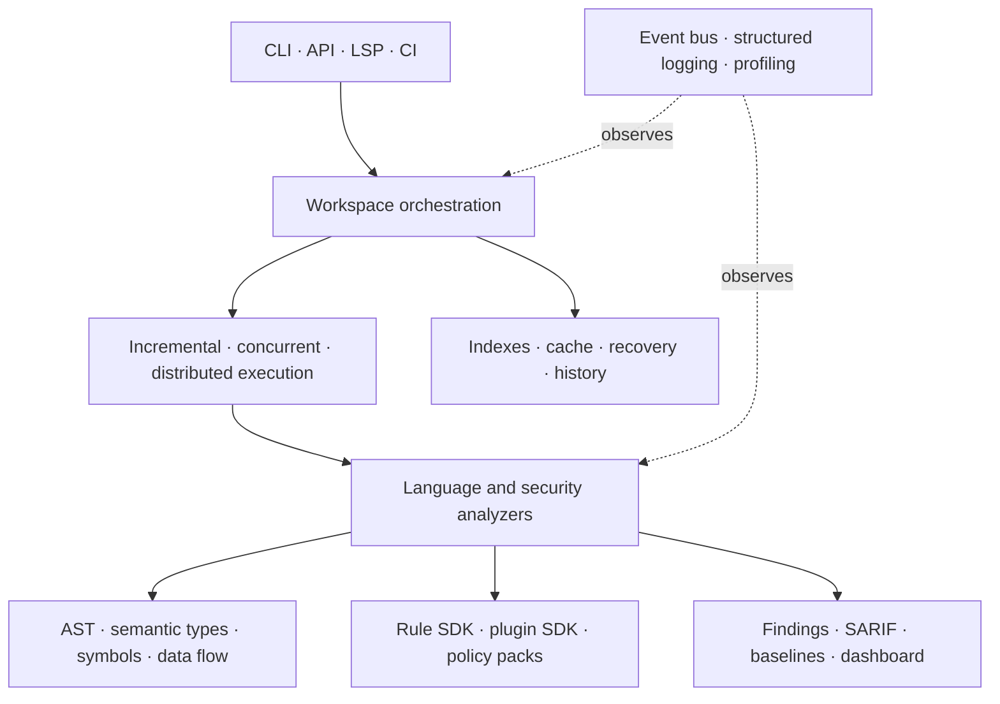

# Atlas architecture and core concepts

Atlas is organized as a layered static-analysis platform. Dependencies should
flow downward through models and explicit service interfaces; CLI, LSP, API,
and reporting adapters sit above analysis and workspace services.

## Core concepts

- A `Workspace` owns deterministic named `Project` definitions and dependency
  order.
- `WorkspaceAnalysisOrchestrator` schedules project analyzers and preserves
  deterministic report order even when project execution is concurrent.
- Persistent state and recovery journals are separate: state restores reusable
  results, while recovery records interrupted execution progress.
- Semantic documents are immutable analysis values. Bulk passes use mutable
  builders internally and freeze once at the public boundary.
- The global symbol database is mutable and synchronized; snapshots are
  detached immutable indexed views.
- Rules run through the rule SDK. Plugins are trusted in-process Python code
  admitted through optional integrity and permission policies.
- Public embedders should import compatibility-guaranteed objects from
  `moughorai.public_api`.

## Ownership boundaries

- `semantic`, `passes`, and language packages own parsing and semantic meaning.
- `workspace` owns project discovery, configuration, planning, execution,
  persistence, recovery, and events.
- `rule_sdk` and `plugin_sdk` own extension contracts and lifecycle.
- top-level reporting modules own stable output transformations.
- `atlas_cli`, `api`, and `lsp` adapt these services; they should not duplicate
  analysis logic.

See the PR-specific documents for detailed contracts and
`PR106_PLUGIN_TRUST_MODEL.md` for the plugin security boundary.
