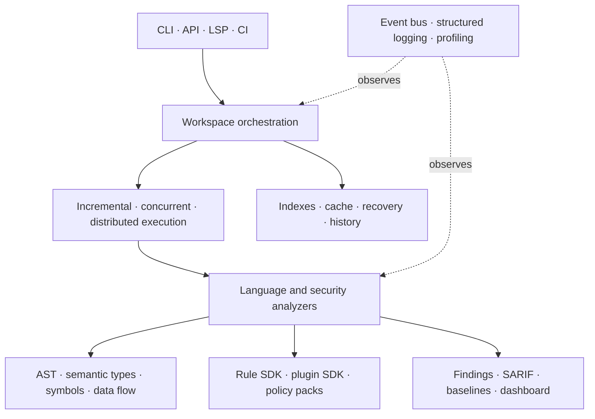
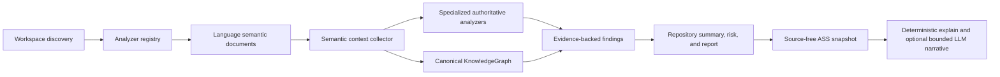

# Atlas architecture and core concepts

Atlas is organized as a layered static-analysis platform. Dependencies should
flow downward through models and explicit service interfaces; CLI, LSP, API,
and reporting adapters sit above analysis and workspace services.

PR144 establishes the first deliberately small platform boundary.
`moughorai.platform` contains only proven domain-neutral infrastructure and
must not import Repository Intelligence, Benchmark Intelligence, CLI, or
persistence concepts. Its first admitted contract is the existing pure
absolute-path safety utility. Any future addition must justify why it cannot
remain inside an existing domain package.

Repository-intelligence ownership through PR134 is deliberately evidence-first:

Language analyzers and specialized domain graphs remain authoritative for the
evidence they produce. The PR129 `KnowledgeGraph` is the canonical integration graph;
it does not replace those analyzers or manufacture unavailable relations. Confidence
is calculated deterministically from structured evidence. Repository reports and
provider-free explanations project persisted facts; an LLM may explain a bounded,
source-free projection but cannot establish facts or change confidence.

## Core concepts

- A `Workspace` owns deterministic named `Project` definitions and dependency
  order.
- `WorkspaceAnalysisOrchestrator` schedules project analyzers and preserves
  deterministic report order even when project execution is concurrent.
- Persistent state and recovery journals are separate: state restores reusable
  results, while recovery records interrupted execution progress.
- Semantic documents are immutable analysis values. Bulk passes use mutable
  builders internally and freeze once at the public boundary.
- The global symbol database is mutable and synchronized; snapshots are
  detached immutable indexed views.
- Rules run through the rule SDK. Plugins are trusted in-process Python code
  admitted through optional integrity and permission policies.
- Public embedders should import compatibility-guaranteed objects from
  `moughorai.public_api`.
- A successful normal analysis publishes one checksum-verified ASS snapshot.
  Snapshot identity covers the exact capture, including history metadata; raw ASS
  hashes are therefore integrity evidence rather than portable semantic identity.

## Ownership boundaries

- `platform` owns only cross-domain, domain-neutral contracts admitted under
  the platform boundary rule.
- `semantic`, `passes`, and language packages own parsing and semantic meaning.
- `workspace` owns project discovery, configuration, planning, execution,
  persistence, recovery, and events.
- `rule_sdk` and `plugin_sdk` own extension contracts and lifecycle.
- top-level reporting modules own stable output transformations.
- `atlas_cli`, `api`, and `lsp` adapt these services; they should not duplicate
  analysis logic.
- `knowledge_graph` owns the canonical repository graph; specialized graph packages
  own their domain evidence and expose it without creating competing canonical
  models.
- `repository_summary`, `risk_analysis`, `repository_report`, and `ai_explain` own
  progressively bounded source-free projections. Missing evidence remains explicit.
- `semantic_snapshot` owns `WorkspaceSemanticContext`; `ai_context` retains
  its established import as an identity-preserving compatibility re-export.

See the PR-specific documents for detailed contracts and
`PR106_PLUGIN_TRUST_MODEL.md` for the plugin security boundary.

The permanent engineering constraints are in
`docs/architecture/ENGINEERING_PRINCIPLES.md`. Stable development and release gates
are defined under `docs/stability/` and exercised by `benchmarks/repository_benchmark.py`.
The official implementation sequence is `docs/roadmap/IMPLEMENTATION_ROADMAP.md`;
shared roadmap dependencies, confidence, evidence, and testing contracts are in
`ROADMAP_DEPENDENCY_MATRIX.md`, `COMMON_CONFIDENCE_MODEL.md`,
`COMMON_EVIDENCE_MODEL.md`, and `COMMON_TESTING_STRATEGY.md`.
