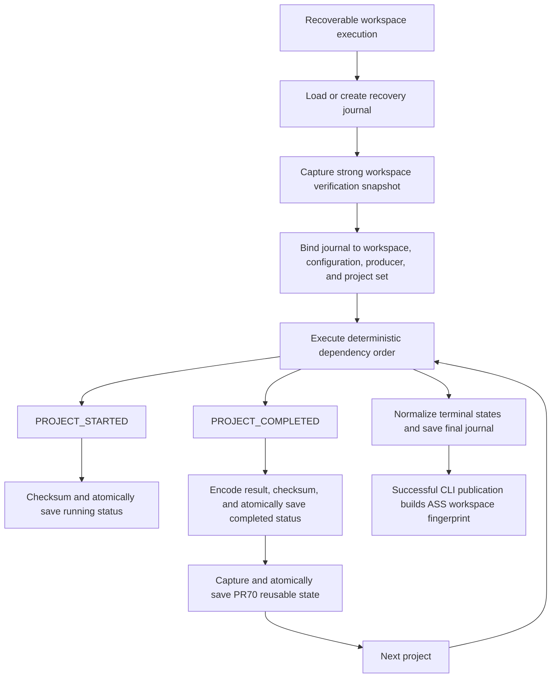

# M2.1 - Recovery Checkpoint Amplification Investigation

## Status and scope

This document records the measurement-led investigation of PR74 recovery
checkpoint amplification. It does not change the roadmap, semantic models,
repository reports, snapshots, Explain output, or accepted benchmark goldens.

The investigation found one generic optimization: retain the verified fingerprint
set for one recovery operation and refresh only the project that just completed.
Immutable `WorkspaceSnapshot` values are replaced deterministically as projects
finish. The journal remains the authoritative per-transition crash checkpoint. PR70
state is still serialized and atomically saved after every completed project.

## Executive conclusion

The retained M2.0 Maven profile reported a real amplification:

- recovery disabled: 19,873 observed content reads;
- recovery enabled: 950,338 observed content reads;
- measured ratio: `47.8205605595532x`;
- recovery disabled: 10,005 content hashes;
- recovery enabled: 940,470 content hashes, exactly `94x`.

Maven has 92 projects. The 94 hash passes are one recovery baseline fingerprint,
92 PR70 state captures, and one semantic-snapshot fingerprint. The root cause is
therefore not an inferred cache effect: every completed project caused
`WorkspaceStateStore.capture()` to call `WorkspaceCache.snapshot()`, walk the whole
workspace, read every selected file, and hash it again.

An initial isolated unprofiled pair corrected the wall-time comparison:

| Mode | Projects | Succeeded | Wall time | CPU time |
| --- | ---: | ---: | ---: | ---: |
| Recovery off | 92 | 92 | 11.4701492 s | 11.4687500 s |
| Recovery on | 92 | 92 | 251.4919606 s | 249.9531250 s |

The unprofiled recovery-on/off wall ratio is `21.9258x`. Both samples used the
same analysis-order digest and encoded-result digest. Their report digests are not
expected to match because run reports contain measured durations.

The final baseline/candidate pair used a detached baseline worktree at commit
`351081f`, the same final diagnostic harness, separate output outside both Git
worktrees, no concurrent repository scans, one worker, and filesystem-warm-or-
uncontrolled conditions:

| Version | Projects | Wall time | CPU time | Deterministic evidence |
| --- | ---: | ---: | ---: | --- |
| Baseline | 92/92 | 248.2918991 s | 246.8906250 s | `b1453b431432d300e1c44e3c5128c92a0d4d15f5916432e6a56c0d85259e4317` |
| Candidate | 92/92 | 97.0328568 s | 95.9375000 s | `b1453b431432d300e1c44e3c5128c92a0d4d15f5916432e6a56c0d85259e4317` |

That controlled pair measured a `60.9198%` wall-time reduction, a `2.5588x`
speedup, and a `61.1417%` process-CPU reduction. The identical harness digest covers
status, order, duration-free report, encoded semantic results, and other deterministic
sample fields. This is one enterprise-repository pair, not a statistical confidence
interval.

A deterministic 12-project synthetic workspace reproduced the structure over six
paired batches:

| Mode | Observed content reads | Median wall time |
| --- | ---: | ---: |
| Recovery off | 240 | 23.7225 ms |
| Recovery on | 3,360 | 405.38045 ms |

The read ratio is exactly `14x`: ordinary analysis plus one initial recovery
verification and 12 repeated project-completion captures. The median wall ratio is
about `17.09x`. This synthetic result establishes reproducibility without relying on
Maven-specific discovery or repository structure.

## Measurement boundaries

The retained 47.82056x figure comes from the opt-in M2 filesystem ledger. It counts
explicit Atlas content-read events, not operating-system block reads or storage-device
operations. All 10,005 Maven resources were tracked, the resource limit was not
reached, and there were zero untracked content reads in that run.

The isolated recovery benchmark creates a separate PR70 state path and PR74 journal
path for every sample. This prevents a completed journal from turning the next sample
into a resume/reuse run. It times workspace execution and recovery only; history and
semantic-snapshot publication remain outside its timed scope.

The retained and synthetic runs are `filesystem-warm-or-uncontrolled`. A portable,
privilege-free method for clearing the Windows filesystem cache was not available.
Consequently, no result in this investigation is labelled OS-cold, and cold-versus-
warm confidence intervals remain unavailable.

## Recovery pipeline

Before M2.1, every `State` transition performed a new full workspace verification.
The selected change preserves every box and every durable write. It retains the
verified fingerprint set and re-hashes only the completed project before binding its
result to the journal and PR70 state.

On resume, Atlas still reads and checksums the journal, computes a fresh current
workspace snapshot, and compares its digest with the journal before decoding or
reusing completed values. Only a matching snapshot becomes the run-scoped verification
snapshot for the resumed operation.

## Source-free file-touch histogram

The M2 collector uses one-way run-local digests to correlate resources, then retains
only aggregate counts and consumer overlaps in the immutable sidecar. Neither those
digests nor source paths enter the report. Combining the exact consumer counts gives
this source-free read-frequency histogram:

| Observed reads per resource | Resources | Evidence |
| ---: | ---: | --- |
| 94 | 4,905 | Workspace fingerprint consumer only |
| 95 | 332 | Workspace fingerprint plus repository summary |
| 96 | 4,768 | 2,791 Java/summary resources plus 1,977 dependency descriptors |
| **Total** | **10,005** | **950,338 content-read events** |

The consumer ranking is:

| Consumer | Reads | Unique resources | Repeated reads | Known bytes | Hashes |
| --- | ---: | ---: | ---: | ---: | ---: |
| Workspace cache/fingerprinting | 940,470 | 10,005 | 930,465 | 2,692,073,896 | 940,470 |
| Dependency intelligence | 3,954 | 1,977 | 1,977 | unavailable | 0 |
| Repository summary | 3,123 | 3,123 | 0 | unavailable | 0 |
| Java analyzer | 2,791 | 2,791 | 0 | unavailable | 0 |

This table does not expose source, paths, filenames, or code. A "read" is an Atlas
ledger event; it must not be interpreted as one physical disk operation.

## Cost model and Pareto ranking

The retained recovery profile reported:

| Rank | Phase | Samples | Inclusive wall sum | CPU sum | Bytes processed |
| ---: | --- | ---: | ---: | ---: | ---: |
| 1 | Persistence | 185 | 200.0725267 s | 197.8437500 s | 1,730,943,150 |
| 2 | Serialization | 93 | 25.3359907 s | 25.2187500 s | unavailable |
| 3 | Semantic snapshot construction | 1 | 2.2324988 s | 2.2187500 s | unavailable |
| 4 | Recovery journal | 187 | 0.8854836 s | 0.7500000 s | 32,531,165 |

These are inclusive sample sums. Parent and child samples can overlap, so the rows
must not be added as exclusive contributions. Code tracing nevertheless establishes
that the 92 repeated workspace captures occur inside persistence and that their
940,470 hashes account for the dominant CPU and read volume. Serialization remains a
separate material cost after fingerprint reuse and is intentionally not optimized in
M2.1.

Memory was not enabled for the retained recovery-on profile, so there is no honest
before/after memory comparison. The isolated post-change diagnostic did enable the
Windows process probe. Its highest observed RSS was 210,726,912 bytes during
persistence/serialization. Python allocation collection was not enabled. This is a
post-change observation, not a measured memory saving.

## Repeated-operation classification

| Operation | Classification | Evidence |
| --- | --- | --- |
| Initial workspace content fingerprint | Required | Establishes the journal input identity. |
| Resume-time workspace verification | Required | Prevents stale values from reaching dependencies. |
| Journal save on project start | Required | Preserves durable running status and crash boundary. |
| Journal save on project completion/failure | Required | Persists completed values and retryable states. |
| PR70 state serialization/save after completion | Required by existing compatibility contract | Keeps reusable partial state and event behavior unchanged. |
| Completion-time fingerprint of the changed project | Required | Preserves strong result-to-content invalidation without rescanning unrelated projects. |
| Re-reading and re-hashing the unchanged workspace for each PR70 capture | Redundant | The same strong snapshot already established the journal epoch. |
| Final journal normalization | Required | Reconciles reused, failed, blocked, and cancelled runs. |
| Successful ASS workspace fingerprint | Required | Establishes semantic-snapshot identity. |

## Correctness invariants

M2.1 must preserve all of the following:

1. The recovery journal remains atomically replaced, checksummed, and durably flushed
   on every existing transition.
2. A completed project is never recorded without its encoded value.
3. Running, failed, and pending projects remain unfinished and retryable.
4. Resume verifies journal schema, checksum, workspace content, configuration,
   producer, project membership, and staleness before reuse.
5. Completed dependency values are decoded only after validation.
6. Concurrent event updates remain serialized by the recovery lock, while report and
   analysis order remain deterministic.
7. PR70 state retains its schema, per-project fingerprints, checksums, atomic save,
   selective invalidation, and event behavior.
8. Ordinary `WorkspaceStateStore.capture()` callers still fingerprint current files.
9. The run-local fingerprint set is never persisted as a new artifact or reused
   across recovery operations; completed projects are refreshed from content before
   their values are checkpointed.
10. Semantic contexts, knowledge graphs, reports, Explain projections, portable
    snapshots, and accepted goldens remain unchanged.

## Options considered

| Option | Correctness | Determinism | Complexity | Risk | Memory | Expected gain |
| --- | --- | --- | --- | --- | --- | --- |
| A - Current behavior | Existing guarantees | High | Low | Proven O(projects x workspace files) cost | High churn; peak unmeasured | None |
| B - Checkpoint batching | Safe only if journal durability is retained; otherwise completed work can be lost | Count batches deterministic; time batches are not | Medium | Changes partial-state and event timing | Slightly lower churn | High but contract-changing |
| C - Deferred fingerprint verification | Unsafe if completed values reach dependencies before verification | Possible | Medium | High stale-reuse risk | Neutral | Startup-only unless work is skipped |
| D - Incremental workspace verification | Can be safe with strong per-file lineage | High | High | Schema, ownership, overlap, and invalidation complexity | Adds retained metadata | Potentially high |
| E - Immutable checkpoint fragments | Can be safe with transactional manifests and checksums | High after canonical reconstruction | Very high | Torn writes, orphan fragments, compaction, and migration | More files and metadata | High serialization potential |
| **Selected - Run-scoped verified fingerprint set** | Preserves completion-time strong fingerprints | High | Low | Bounded to one operation; no schema change | One immutable value retained/replaced | Removes full-workspace repeats |

Authoritative journal batching was rejected because it weakens crash granularity.
Final-only PR70 state persistence was rejected because it changes partial-state
freshness and `state_saved` event frequency. Deferred, incremental, and fragment
designs are disproportionate before the small proven redundancy is removed.

## Selected design

At new-run startup, `WorkspaceRecoveryManager` obtains the normal strong PR70
workspace snapshot and derives the journal fingerprint from it. The immutable
`WorkspaceSnapshot` is retained only until that `execute()` call finishes. When a
project completes, Atlas fingerprints that project once, creates a replacement
snapshot containing the refreshed digest, and binds both the journal value and PR70
state to that fingerprint set. It does not walk every other project again.

At resume, `_load_valid()` computes a fresh snapshot exactly as before. It returns
that snapshot only after the journal workspace fingerprint matches. The resumed run
then uses the verified snapshot for its remaining per-project state captures.

Recovery uses a private `WorkspaceStateStore` integration for the verified snapshot.
It validates exact deterministic project names and ordering before use. The public
`capture(results, valid_projects)` signature and behavior are unchanged, including
fresh whole-workspace verification for ordinary callers. The state and journal
schemas and serialized shapes do not change.

This is not a cache:

- it begins with a full strong content verification;
- each completed project is strongly re-hashed once before checkpoint publication;
- it is scoped to one `execute()` or `resume()` operation;
- it is cleared in a `finally` boundary;
- it is not shared between managers or processes;
- it is not persisted as new metadata;
- it does not substitute timestamps or file metadata for content hashes.

The evolving journal fingerprint allows a change present at project completion to
be resumed under the matching content and rejects it if the project later returns to
its earlier bytes. Atlas does not provide a filesystem transaction and cannot prove
an ABA mutation that changes and returns to identical bytes entirely inside one
analyzer invocation; that pre-existing boundary is unchanged.

## Post-change measurement

The selected design removes 91 of the 93 comparable Maven fingerprint-pass
equivalents but preserves all 92 PR70 serializations and saves. The final isolated
post-change profile measured:

| Recovery/execution metric | Retained pre-change evidence | Measured candidate | Interpretation |
| --- | ---: | ---: | --- |
| Workspace-cache hashes | 930,465 for the comparable 93 recovery passes | 20,010 | one baseline plus one cumulative project refresh |
| Total content reads | 935,233 by the comparable count model | 24,778 | recovery/execution harness excludes ASS publication |
| Persistence scopes | 185 | 185, all successful | contract intentionally preserved |
| State serializations | 92 | 92, all successful | not an M2.1 target |
| PR70 state bytes processed | 1,730,943,150 | 1,730,943,150 | write amplification unchanged |
| Recovery scopes | 187 | 187, all successful | journal durability unchanged |

The post-change filesystem ledger observed 24,778 reads, 20,010 hashes, 24,633
directory enumerations, 276 path normalizations, and 57,278,168 known bytes. Each
workspace resource was read twice by the cache: once at validation and once as its
owning project completed. Persistence scopes consumed 9.5454100 s wall and
9.2187500 s CPU; state serialization consumed 26.5392514 s wall and 26.4687500 s
CPU. Recovery journal scopes consumed 57.4746879 s wall and 56.6250000 s CPU while
processing 3,608,735,822 cumulative bytes. These phase times are inclusive.

The final source-free measurement sidecar is 4,867,389 bytes with SHA-256
`f1c0d12b3b90e517e0693eac4926006dd62a9919d03b193a46e86e3c5b85cdf5`.
Raw PR70 state and PR74 journal files are operational recovery artifacts and are not
claimed source-free; only their byte counts and hashes belong in a source-free
measurement bundle.

The complete CLI additionally fingerprints the workspace for successful ASS
publication. Its structural post-change count is therefore 39,883 reads and 30,015
hashes. That complete-CLI count remains a projection until a profiled CLI run is
retained; it is not substituted for the measured recovery/execution boundary above.

Two pilot profiles wrote their large mutable artifacts inside the Atlas worktree
while other processes scanned it; Windows reported failed atomic-replace scopes.
Those pilots were rejected. The final isolated profile above recorded zero failed
persistence, serialization, or recovery scopes.

## Validation gates

The candidate is acceptable only if targeted tests and repeated measurements prove:

- exact PR70 and PR74 serialization round trips;
- unchanged corruption, producer, configuration, staleness, project-set, and workspace
  invalidation;
- interruption resumes only unfinished projects;
- completed dependency values remain available;
- deterministic concurrent recovery behavior;
- supplied snapshots with missing, extra, or reordered projects are rejected;
- run-scoped snapshots cannot leak into a later operation;
- ordinary PR70 capture still observes later file changes;
- identical encoded result and analysis-order hashes before and after;
- source-free compact benchmark bundle and M2 sidecar, with raw recovery artifacts
  excluded from that claim;
- full test suite, `compileall`, and `git diff --check` success;
- unchanged accepted results for Maven, Quarkus, Spring Framework, Elasticsearch, and
  the known IntelliJ diagnostic boundary.

## Limitations and remaining opportunities

- The large-repository unprofiled comparison is one controlled Maven pair, not a
  confidence interval.
- The six-pair synthetic evidence proves the mechanism but not enterprise filesystem
  variance.
- OS-cold results are unavailable.
- M2 content-read events are Atlas boundaries, not physical I/O counters.
- Baseline RSS and allocation counts remain unavailable; post-change RSS alone cannot
  establish a memory improvement.
- Per-completion state serialization and atomic writes remain as measured future
  optimization candidates.
- The journal still writes every transition by design; its retained measured wall sum
  was not a Pareto target.
- No persistent incremental verification, metadata shortcut, batching policy, or
  fragment format was introduced.

## Recommendation for M2.2

First complete post-change A/B validation on the five accepted repositories. If
serialization and state writes become the new measured Pareto leader, M2.2 may
investigate deterministic state-delta or immutable-fragment persistence. It must keep
the journal authoritative, preserve per-project crash recovery, and begin with a new
measurement rather than adopting Options B or E speculatively.
